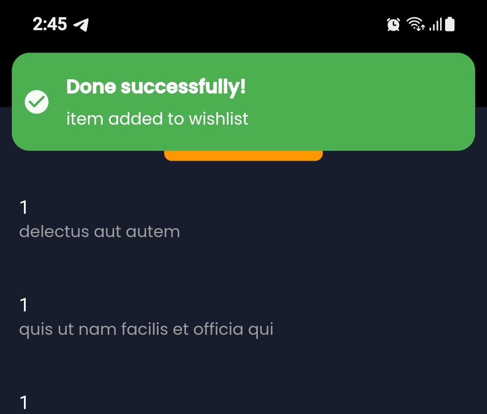
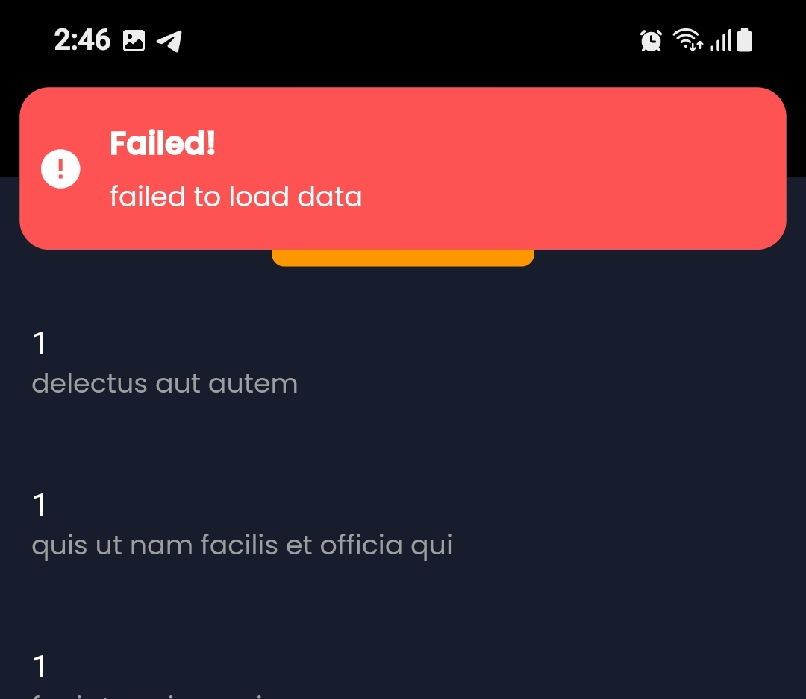
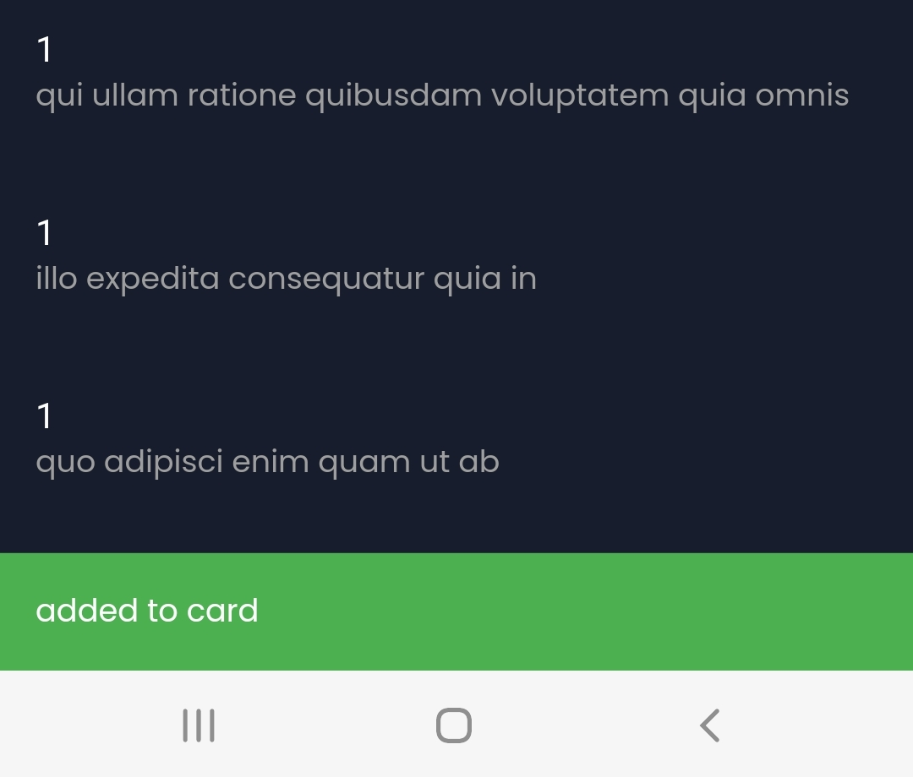
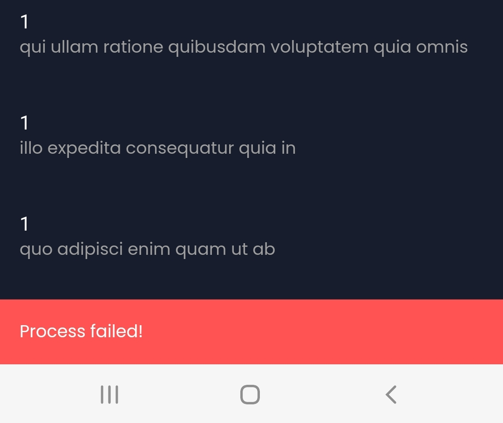

# Flutter GetX Template

Flutter Getx template: Starting up new project with all needed configuration has never been easier.

## Introduction

We all face the same problem when we want to start a new project we have to take care of some repeatable things such as
- Theme (light/dark) & store current theme in shared pref 🌒
- Localization & store the current locale in shared pref 🅰️
- Firebase Messaging 📨
- Notifications setup 🔔
- Safe api requests & error handling 🔏
- Changing between widgets during api call (loading,success,failed..etc) 😴
- Snackbar,Toasts & in app notifications 🪖
- Making app more responsive and stop font scaling ⚖️
  This project will take care of all this repeatable things so you can start your project in few steps and you will have all the mentioned points set up and ready to use 😎

## What is new 🌟

- [x] Separate Local Notification helper from fcm helper 🛠️
- [x] Integration Test for BaseClient 🧪
- [x] Integration Test for Awesome Notifications Helper 🧪
- [x] Integration Test for Widget Animator 🧪
- [x] Unit Test also for BaseClient 🧪
- [x] Unit Test for MySharedPreference 🧪
- [x] Unit Test for MyHive 🧪
- [x] Unit Test for Localization Service 🧪
- [x] Replace get_storage with SharedPref (unsolved testing problems with get_storage) 📦️
- [x] Refactor Code 🛠️
- [ ] Support Web (in progress) 💡

## Acknowledgment
Project was created using [get_cli](https://pub.dev/packages/get_cli) which is a great tool helping you to (start project,create screens/controllers, handling DI)..etc and we will list other packages that helped to create this skeleton
- [GetX](https://pub.dev/packages/get) for state management,navigation,managing dependencies..etc
- [flutter_screenutil](https://pub.dev/packages/flutter_screenutil) to make app more responsive
- [hive](https://pub.dev/packages/hive) as local database
- [shared_preferences](https://pub.dev/packages/shared_preferences) store data persistently as key/value
- [awesome_notifications](https://pub.dev/packages/awesome_notifications) for local notification
## Clone and start project
Before discovering folders lets first perform some actions to make the project ready to launch
- first run this command it will generate hive type adapters (for our custom classes that we want to store locally)

    ```
    flutter packages pub run build_runner build --delete-conflicting-outputs
    ```
  if you don't want to use hive comment this line in main.dart

    ```dart
    await MyHive.init(adapters: [UserModelAdapter()]);
    ```
- To make your app responsive and look exactly as your (xd,figma..etc) design you need to set artbord size for flutter_ScreenUtil in main.dart
    ```dart
    ScreenUtilInit(
      designSize: const Size(375, 812), // change this to your xd artboard size
    ```
- FCM & Awesome Notifications are combined at the same class so when ever you connect your app to firebase your app will be ready to receive notifications you don't need to do anything except sending fcm notification to your api via implementing the method (sendFcmTokenToServer) which is inside FcmHelper class 😎
    ```dart
    static _sendFcmTokenToServer(){
        var token = MySharedPref.getFcmToken();
        // TODO SEND FCM TOKEN TO SERVER
    }
    ```
- Change app package name
    ```
    flutter pub run change_app_package_name:main com.new.package.name
    ```
- Change app name
    ```
    flutter pub run rename_app:main all="My App Name"
    ```
- Change app launch icon (replace assets/images/app_icon.png with your app icon) then run this command
    ```
    flutter pub run flutter_launcher_icons:main
    ```
- FCM: firebase has recently added (add flutter app) to your firebase which will make adding our flutter(android/ios) app to firebase take only 2 steps 🔥 but first you need to download [Firebase CLI](https://firebase.google.com/docs/cli?authuser=0&hl=en#install_the_firebase_cli) and in the terminal execute:
    ```
    dart pub global activate flutterfire_cli
    ```
  then follow the firebase guid you will get command similar to this one
    ```
    flutterfire configure --project=flutter-firebase-YOUR_PROJECT_ID
    ```
  and that's it! your project is now connected to firebase and fcm is up and ready to get notifications
  ##### Important Note
  IOS require few more steps from your side to recive fcm notifications follow the [Dcos](https://firebase.flutter.dev/docs/messaging/apple-integration/) steps and after that everything should be working fine from flutter side
## Quick Start
- Responsive app: to make your app responsive you need to get advantage of using flutter_ScreenUtil so instead of using normal double values for height,width,radius..etc you need to use it like this
-
  ```dart
  200.w // adapted to screen width
  100.h // /Adapted to screen height
  25.sp // adapter font size
  10.r // adapter radius
  // Example
  Container(
      height: 100.h,
      width: 200.w,
      child: Text("Hello",style: TextStyle(fontSize: 20.sp,))
  )
  ```

- Theme
  - Change theme

      ```dart
      MyTheme.changeTheme();
      ```

  - Check current theme

      ```dart
      bool isThemeLight = MyTheme.getThemeIsLight();
      ```

- Localization
  - Change app locale

      ```dart
      LocalizationService.updateLanguage('en');
      ```

  - Get current locale

      ```dart
      LocalizationService.getCurrentLocal();
      ```

  - Use translation

      ```dart
      Text(Strings.hello.tr)
      ```

- Safe api call
  - logic code (in controller)
      ```dart
        // hold data coming from api
        List<dynamic> data;
    
        // api call status
        ApiCallStatus apiCallStatus = ApiCallStatus.holding;

        // getting data from api
        getData() async {
          // *) perform api call
          await BaseClient.safeApiCall(
            Constants.todosApiUrl, // url
            RequestType.get, // request type (get,post,delete,put),
            onLoading: () {
              // *) indicate loading state
              apiCallStatus = ApiCallStatus.loading;
              update();
            },
            onSuccess: (response){ // api done successfully
              data = List.from(response.data);
              // -) indicate success state
              apiCallStatus = ApiCallStatus.success;
              update(); // update ui
            },
            // if you don't pass this method base client
            // will automatically handle error and show error message to user
            onError: (error){
              // show error message to user
              BaseClient.handleApiError(error);
              // -) indicate error status
              apiCallStatus = ApiCallStatus.error;
              update(); // update ui
            },
          );
        }
      ```
  - UI: MyWidgetsAnimator will animate between widgets depending on current api call status

      ```dart
      GetBuilder<HomeController>(
      builder: (controller){
        return MyWidgetsAnimator(
            apiCallStatus: controller.apiCallStatus,
            loadingWidget: () => const Center(child: CircularProgressIndicator(),),
            errorWidget: ()=> const Center(child: Text('Something went wrong!'),),
            successWidget: () =>
               ListView.separated(
                itemCount: controller.data!.length,
                separatorBuilder: (_,__) => SizedBox(height: 10.h,),
                itemBuilder: (ctx,index) => ListTile(
                    title: Text(controller.data![index]['userId'].toString()),
                    subtitle: Text(controller.data![index]['title']),
                  ),
              ),

        );
      },
    )
      ```

- Snackbars (in app notify):

    ```dart
    CustomSnackBar.showCustomSnackBar(title: 'Done successfully!', message: 'item added to wishlist');
    CustomSnackBar.showCustomErrorSnackBar(title: 'Failed!', message: 'failed to load data');
    CustomSnackBar.showCustomToast(message: 'added to card');
    CustomSnackBar.showCustomErrorToast(message: 'added to card');
    ```

  &nbsp;&nbsp;&nbsp;&nbsp;&nbsp;&nbsp;

## Discovering Project
After setting up all the needed thing now lets talk about folder structure which is mainly based on Getx Pattern and there are some personal opinions, if you open your lib folder you will find those folders

```
.
└── lib
    ├── app
    │   ├── components
    │   ├── data
    │   │   ├── local
    │   │   └── models
    │   ├── modules
    │   │   └── home
    │   ├── routes
    │   └── services
    ├── config
    │   ├── theme
    │   └── translation
    └── utils
```

- app: will contain all our core app logic
  - components: will contain all the shared UI widgets
  - data: will contain our models and local data sources (local db & shared pref)
  - modules: app screens
  - routes: generated by get_cli and it will contain our navigation routes
  - services: contain all logic for making safe & clean api calls
- config: will contain app config such as themes, localization services
- utils: for our helper classes
## Features
- Theme: if you opened theme package you will see those files

    ```
    └── theme
        ├── dark_theme_colors.dart
        ├── light_theme_colors.dart
        ├── my_fonts.dart
        ├── my_styles.dart
        └── my_theme.dart
   
    ```

  you only need to change app colors (light/dark_theme_colors) and if you want to change app fonts sizes and family just modify my_fonts.dart and that is it you don't need to worry about styles and theme you only need to edit my_syles.dart if you want to change some element theme data (padding,border..etc) and if you want to change theme just use this code

    ```dart
    // change theme and save current theme state to shared pref
    MyTheme.changeTheme();
    ```

  and if you want to check if the theme is dark/light just use
    ```dart
    bool themeIsLight = MyTheme.getThemeIsLight();
    // OR
    bool themeIsLight = MySharedPref.getThemeIsLight();
    ```
- Localization/translation we will use getx localization system which in the normal case code would look something like this

    ```dart
    class LocalizationService extends Translations {
        @override
        Map<String, Map<String, String>> get keys => {
            'en_US': { 'hello' : 'Hello' },
            'ar_AR': { 'hello' : 'مرحباً' },
        };
    }

    Text('hello'.tr); // translated text 
  ```

  but because we have so many words to translate we will separate keys file (strings_enum.dart) and languages map into different classes so code will become like this

  ```dart
  class LocalizationService extends Translations {
        @override
        Map<String, Map<String, String>> get keys => {
            'en_US': enUs,
            'ar_AR': arAR,
        };
    }
  // keys
  class Strings {
      static const String hello = 'hello';
  }
  // english words
  const Map<String, String> enUs = {
      Strings.hello : 'Hello',
  }
  // arabic translate
  final Map<String, String> arAR = {
      Strings.hello : 'مرحبا',
  }
  //result
  Text(Strings.hello.tr)
  ```

  and that explain why we have this file structure inside our translation package

     ```
        └── translations
            ├── ar_Ar
            │   └── ar_ar_translation.dart
            ├── en_US
            │   └── en_us_translation.dart
            ├── localization_service.dart
            └── strings_enum.dart
     ```

  to change language you will use

    ```dart
    LocalizationService.updateLanguage('en');
    ```

  and to get the current locale/language you can use

    ```dart
    LocalizationService.getCurrentLocal();
    // OR
    MySharedPref.getCurrentLocal();
    ```

- Safe api call: under if you opened lib/app/services package you will find 3 files
  - api_call_status.dart: which contain all possible stages of our api call (loading,success,error..etc)
  - api_exception.dart: custom exception class to make error handling more informative
  - base_client.dart: contain our safe api call functions
    to perform api request the right way you would do this

```dart
class HomeController extends GetxController {
  // hold data
  List<dynamic>? data;
  // api call status
  ApiCallStatus apiCallStatus = ApiCallStatus.holding;

  // getting data from api simulating
  getData() async {
    // *) indicate loading state
    apiCallStatus = ApiCallStatus.loading;
    update();
    // *) perform api call
    await BaseClient.safeApiCall(
      Constants.todosApiUrl, // url
      RequestType.get,
      onSuccess: (response){ // api done successfully
        data = List.from(response.data);
        // -) indicate success state
        apiCallStatus = ApiCallStatus.success;
        update(); // update ui
      },
      // if you don't pass this method base client
      // will automatically handle error and show message
      onError: (error){
        // show error message to user
        BaseClient.handleApiError(error);
        // -) indicate error status
        apiCallStatus = ApiCallStatus.error;
        update(); // update ui
      }, // error while performing request
    );
  }

  @override
  void onInit() {
    getData();
    super.onInit();
  }
}
```

base client will catch all the possible errors and if you didn't pass onError function it will automatically catch the error in UI side code will be

```dart
GetBuilder<HomeController>(
        builder: (_){
          return MyWidgetsAnimator(
              apiCallStatus: controller.apiCallStatus,
              loadingWidget: () => const Center(child: CircularProgressIndicator(),),
              errorWidget: ()=> const Center(child: Text('Something went wrong!'),),
              successWidget: () =>
                 ListView.separated(
                  itemCount: controller.data!.length,
                  separatorBuilder: (_,__) => SizedBox(height: 10.h,),
                  itemBuilder: (ctx,index) => ListTile(
                      title: Text(controller.data![index]['userId'].toString()),
                      subtitle: Text(controller.data![index]['title']),
                    ),
                ),

          );
        },
      )
```
**NOTE:** MyWidgetsAnimator will take care of ui changing with animation you will pass the ApiCallStatus and success,failed,loading..etc widgets and it will take care of transition

## Support

For support, email emadbeltaje@gmail.com or Facebook [Emad Beltaje](https://www.facebook.com/EmadBeltaje/).
