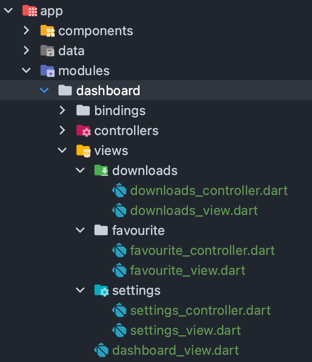
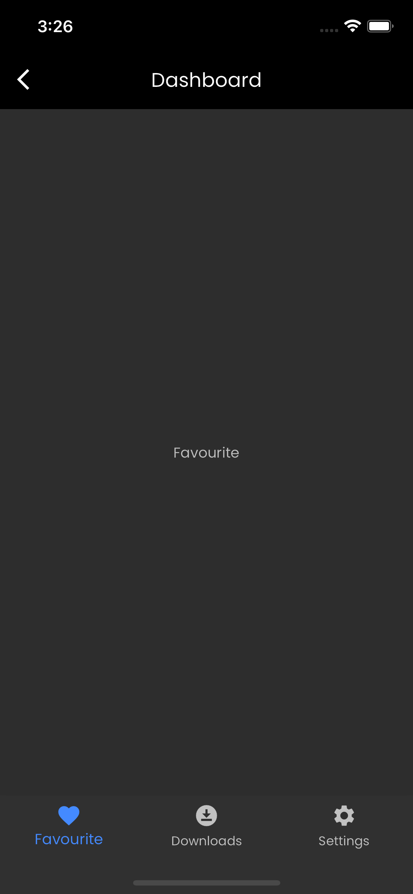

# Navigation Bar Example [(Material 3)](https://youtu.be/DVGYddFaLv0) 🚀

> -1 create the main screen (that will contain the navigation bar) lets call it (Dashboard) in our case
```sh
get create page:dashboard
```

> -2 create the sub screens with thier controllers manually (i prefer to put them on the views folder of the main screen)


> -3 now to initialize the controllers you can add them to start with the main screen binding (that is one of many ways)
```dart
class DashboardBinding extends Bindings {
  @override
  void dependencies() {
    Get.put<DashboardController>(DashboardController());
    // initialize sub screens controllers
    Get.put<FavouriteController>(FavouriteController());
    Get.put<DownloadsController>(DownloadsController());
    Get.put<SettingsController>(SettingsController());
  }
}
```

> 4- add indexed stack and bottom navigation to the main screen (dashboard)
```dart
class DashboardView extends GetView<DashboardController> {
  const DashboardView({Key? key}) : super(key: key);
  @override
  Widget build(BuildContext context) {
    return GetBuilder<DashboardController>(
      builder: (controller) {
        return Scaffold(
          appBar: AppBar(
            title: Text(Strings.dashboard.tr),
          ),
          body: IndexedStack(
            index: controller.selectedIndex,
            children: [
              FavouriteView(),
              DownloadsView(),
              SettingsView(),
            ],
          ),
          bottomNavigationBar: NavigationBar(// The navigation bar itself
            destinations: [
              NavigationDestination(
                icon: Icon(Icons.favorite),
                label: Strings.favourite.tr,
              ),
              NavigationDestination(
                icon: Icon(Icons.download_for_offline),
                label: Strings.downloads.tr,
              ),
              NavigationDestination(
                icon: Icon(Icons.settings),
                label: Strings.settings.tr,
              ),
            ],
            selectedIndex: controller.selectedIndex,
            onDestinationSelected: (int index) {
              controller.onDestinationSelected(index); // Update selected index in controller
            },
          ),
        );
      }
    );
  }
}
```

> 5- Add this code to the main screen controller (dashboard controller)
```dart
class DashboardController extends GetxController {
  int selectedIndex = 0;

  onDestinationSelected(int selectedIndex){
    this.selectedIndex = selectedIndex;
    update();
  }
}
```

# Final Result ⭐️

